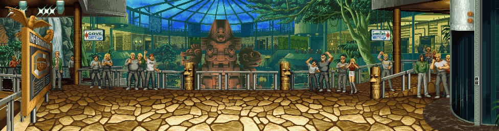

# NGBG

A Neo Geo background extraction tool. With just a few clicks, you can extract the backgrounds of Neo Geo games into animated gifs. Usually the hardest part is playing the game long enough to get the background you are interested in loaded into memory :)

This image was created with the tool, as were many of the backgrounds at https://www.fgbg.art

## Status

The tool now successfully extracts a lot of backgrounds. There is still much work to be done:
  
TODO:

* support manual sprite animation
* more options for dealing with parallax mismatches
  * currently have mirroring as only option
  * also need to extend last color and fade to black as additional solutions
  * TODO: document this
* make it more user friendly
  * a nice UI
  * patch gngeo to support any neo geo rom instead of the specific formats it currently expects
  * instructions on how to use it
* support for vertical games (ie aerofighters, strikers, etc)
  * currently the tool assumes the background will be horizontally oriented
  * need a vert <-> hori toggle that applies the assumptions to either x or y, depending on chosen mode
* loading indicator while downloading gngeo, which is about 3 megabytes
  * would also be nice to keep trimming the stuff out of gngeo that ngbg doesn't need, to cut that 3 megs down more

The tool can also extract character sprites pretty easily

## How to use

This is TODO

I will create detailed instructions as the tool matures. This tool proved to be a lot more work than I thought it would be, so it might be a while before it's really usable

NOTE: gngeo is the emulator that is running, and it wants your ROM files to be in a very specific format. For me, my samsho2, mslug, kof94 and kof95 roms all work fine. But my aof, aof3, pulstar, etc ROMs do not load. I'll eventually fix this.

game controls:

player one

* directions: arrow keys
* start: 1
* coin: 3
* a: z
* b: x
* c: a
* d: s
  
player two

* directions: h,j,k,l
* start: 2
* coin: 4
* a: y
* b: u
* c: i
* d: o

### Changing the controls

The controls are defined in `gngeo/src/virtualfs/gngeorc`. They are defined using SDL key codes. Make changes, then `yarn build-gngeo` to get the changed gngeorc positioned for emscripten to consume it.

